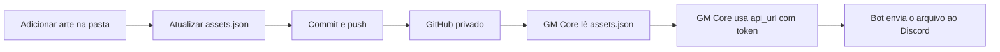

# Fluxograma

```mermaid
flowchart LR
    A[Adicionar arte na pasta] --> B[Atualizar assets.json]
    B --> D[Commit e push]
    D --> E[GitHub privado]
    E --> F[GM Core lê assets.json]
    F --> G[GM Core usa api_url com token]
    G --> H[Bot envia o arquivo ao Discord]
```

O repositório de artes contém apenas arquivos estáticos e termina no GitHub privado. O código de consumo, a autenticação e o envio ao Discord pertencem ao GM Core.
